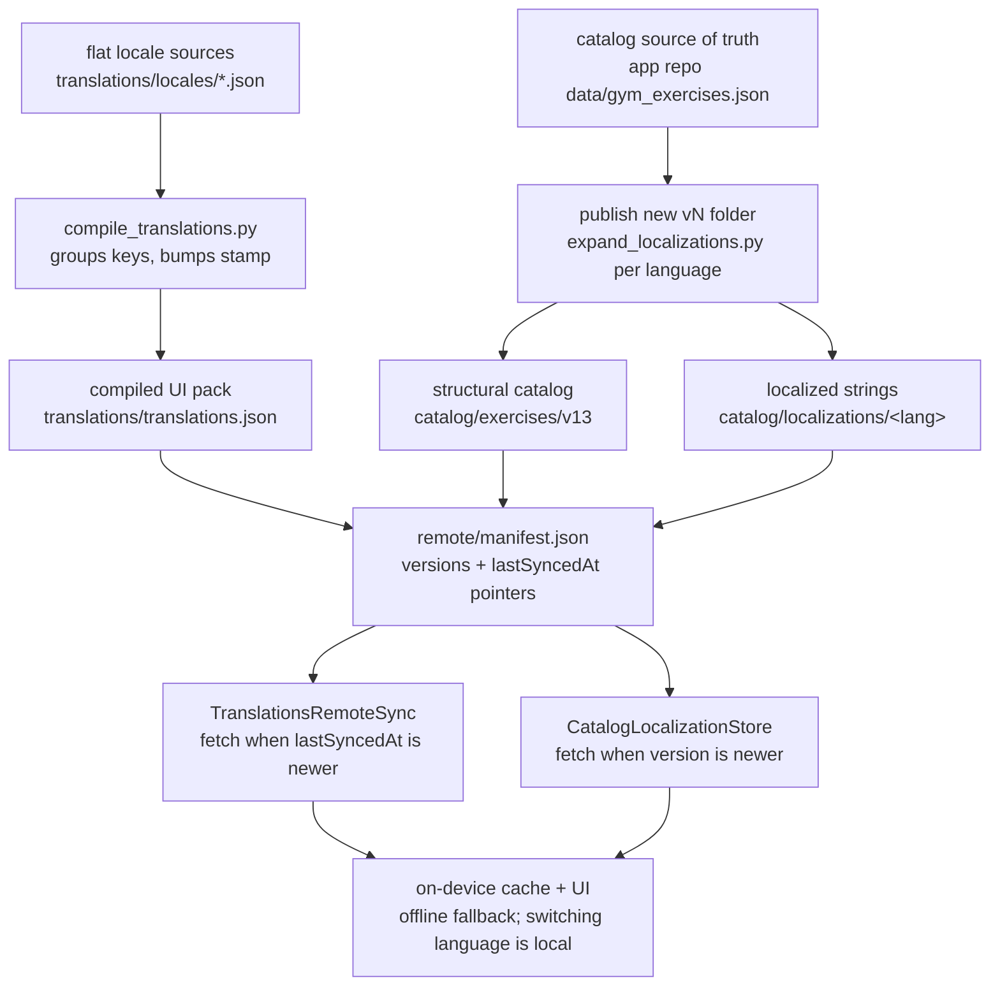

# Content pipeline — translations vs catalog

Two unrelated content systems live under `remote/`, and both look like "translations" from the outside:

- **`remote/translations/`** — UI copy (buttons, titles, alerts). Ten languages in one compiled pack.
- **`remote/catalog/`** — exercise content. Split into a language-neutral structural catalog plus separate per-language localization files.

`remote/manifest.json` is the only URL the app knows. Everything else is reached through pointers in it.

## Flow



## System 1 — UI copy (`remote/translations/`)

Authoring source is one flat file per language:

```text
remote/translations/locales/
  en.json … ar.json    # flat dotted key → string
  keys.json            # canonical key set / order (1420 keys)
  meta.json            # schemaVersion, lastSyncedAt, locale list, catalogKeyPrefixes
```

`scripts/compile_translations.py` pivots those into the published pack:

```json
{
  "lastSyncedAt": 1785449754,
  "strings": {
    "Common": { "done": { "en": "Done", "ru": "Готово", "…": "…" } }
  }
}
```

The pack carries **all ten languages in one payload**. The app downloads it once; switching language re-resolves strings locally with no refetch.

Rules when editing: don't rename or delete keys in `keys.json` unless the app code changes too; every non-catalog key needs all ten locales; preserve placeholders exactly (`%@`, `%lld`, `%1$@`).

Supported locales: `en`, `ru`, `hy`, `sv`, `nb`, `nl`, `da`, `pl`, `fr`, `ar`. English is the canonical source. Norwegian uses `nb` (device `no` maps to `nb`). Arabic is MSA with RTL layout.

## System 2 — exercise catalog (`remote/catalog/`)

Deliberately split in two, so a translation fix never touches exercise structure and vice versa.

**Structural, language-neutral** — ids, muscles, `loggingType`, `logParams`. Never translated.

```text
catalog/exercises/v13/gym_exercises.json
catalog/supersets/v3/gym_supersets.json
catalog/templates/v7/gym_templates.json
```

**Text layer, per language** — keyed by the same structural ids.

```text
catalog/localizations/<lang>/vN/exercises.localization.json
catalog/localizations/<lang>/vN/supersets.localization.json
```

```json
{
  "schemaVersion": 1,
  "language": "ru",
  "version": 5,
  "catalogVersion": 12,
  "exercises": {
    "arms-barbell-curl": {
      "name": "…",
      "instructions": ["…"],
      "safety": [{ "index": 0, "title": "…", "description": "…" }]
    }
  }
}
```

`safety` rows reference the structural catalog's array **index**, not an id.

The client downloads **only the active app language**, and exercises / supersets are gated independently.

## What triggers a download

| Manifest pointer | Gate |
| --- | --- |
| `translations.lastSyncedAt` | Unix seconds. Fetch when strictly greater than the local watermark, or when the local cache is missing (first launch / recovery). |
| `catalog.exercises.version` · `supersets` · `templates` | Integer content revision vs `catalogSeedVersion` / `supersetCatalogSeedVersion` / `templateCatalogSeedVersion`. |
| `catalog.localizations.<lang>.exercises` · `supersets` | Integer vs `catalogLocalizationExercisesVersion.<lang>` / `catalogLocalizationSupersetsVersion.<lang>`. Active language only. |
| `exerciseImages.revision` | Bump when image bytes change at an existing path. Applies on next launch or foreground refresh. |

`manifest.schemaVersion` (currently `2`) is the **manifest contract**, not a content revision. Bump it only when the client-facing shape changes; unknown keys are ignored by older clients.

Catalog `version` integers are a content revision, not a schema version — bump on any add, remove, or edit, or clients keep the old watermark and skip the download.

## Where to edit what

| Change | Edit | Then |
| --- | --- | --- |
| UI string | `remote/translations/locales/<lang>.json` | `python3 scripts/compile_translations.py --bump-timestamp`, then `python3 scripts/generate_translation_keys.py` in the app repo |
| Exercise / superset / template row | app repo `data/gym_exercises.json` (etc.), bump its top-level `version` | publish `catalog/exercises/vN+1/`, repoint `manifest.catalog.*.version` + `url` |
| Exercise name / instructions / safety in one language | `catalog/localizations/<lang>/vN/` | bump that pointer's `version` only |
| Form guide art | `remote/images/exercises/<formGuideAsset>.png` | bump `exerciseImages.revision` if replacing bytes at an existing path |

After publishing, purge the CDN for the stable manifest:

```bash
curl -s "https://purge.jsdelivr.net/gh/davoxdavo/weightliftingAssets@main/remote/manifest.json"
```

## Hosting

Three hosts in one manifest, each for a reason:

| Content | Host | Why |
| --- | --- | --- |
| catalog + translations JSON | `raw.githubusercontent.com` | correct content type, no purge lag on `main` |
| `exerciseImages.baseURL` | `cdn.jsdelivr.net` | image CDN throughput |
| `legal/*.html` | `davoxdavo.github.io` (GitHub Pages) | jsDelivr serves `.html` as `text/plain`, so browsers show source |

## Known inconsistencies

Observations from tracing the tree, not scheduled work.

1. **Directory `vN` ≠ content `version`.** `catalog/localizations/en/v3/exercises.localization.json` carries `"version": 5`, and the manifest declares `5` while pointing at the `v3` path. Same for `sv`, `nb`, `nl`, `da`, `pl`, `fr`, `ar`. Only `ru` and `hy` line up (`v6` / version 6). Functionally fine — clients compare the integer, not the path — but the folder name misstates the revision.
2. **Exercise names live in both systems.** `translations.json` still carries 343 legacy `exercise.catalog.*` / `superset.catalog.*` / `template.catalog.*` keys, `en` / `ru` / `hy` only. These predate `catalog/localizations/` and are the older way of translating exercise names.
3. **Stale payloads published.** `catalog/exercises/v10`, `v11` and `v12` are all still in the tree. The app repo's `data/REMOTE_MANIFEST.md` says to prune down to the current supported payload (`v13`).
4. **`manifests/content-10-7.json` is a snapshot, not an entrypoint.** Shipping builds must keep `REMOTE_MANIFEST_URL` on the stable `remote/manifest.json`.
5. **`catalogVersion` drift — resolved 2026-07-31.** Localization files now declare `"catalogVersion": 13`, matching the served `catalog/exercises/v13`. (It read `11` against a served `v12` until the v13 rename pass re-stamped them.) The field is advisory; nothing on the client compares it.

## See also

- [`README.md`](README.md) — repo layout and CDN overview
- [`remote/translations/locales/README.md`](remote/translations/locales/README.md) — authoring rules for flat locale files
- App repo `data/REMOTE_MANIFEST.md` — full manifest field reference and operator recipes
- App repo `data/SHIP_CATALOG_UPDATE.md` — step-by-step catalog release playbook
- App repo `TRANSLATIONS_AND_SYMBOLS.md` — the "every UI copy change updates this pack" rule
